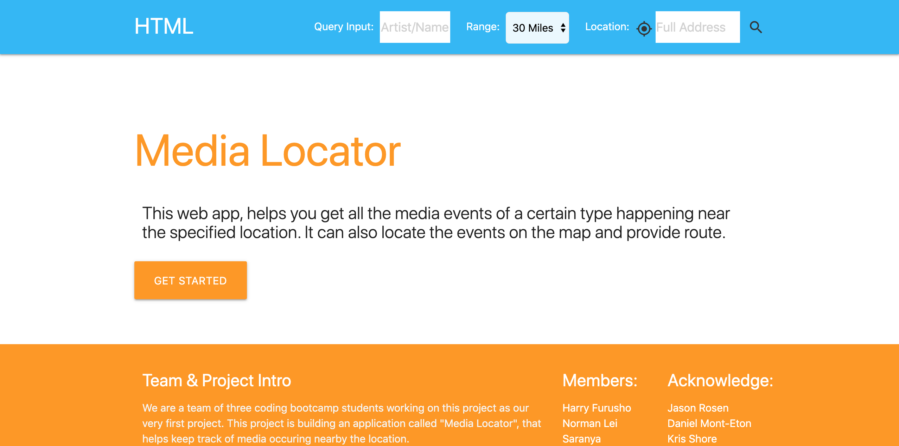
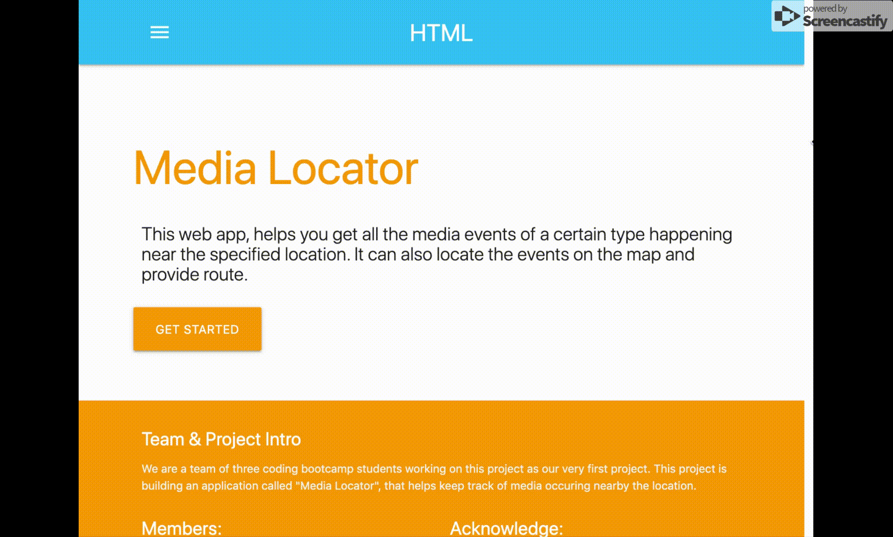

# Project-01-Locator

## Description

As proceeing as a web developer, team project would be a mush-do thing in the real world. In our first project, our team "HTML" is building an application called "Media Locator",mainly using another application's API. This application can locate the place you are at or take in a specified location. After that, based on the name of a(n) artist/book/author/movie/comedian, lists recommendations related to the search and indicate if any of them have events near the location. Then the user can locate the place on the embedded Google map, get route to it and navigate separately. 

In this application, it mainly has two parts as below:
* Search/Start page along with input entering boxes

* Results display page along with a few functionalities

In the process of building this calendar, we have learned:
* Utilize Github repository, familiarize git commands to save all my works onto github
* Familiarize the basic html commands to build the full contents of the site, especially have better understanding on div.
* Familiarize the styling commands on css, especially have better understanding on float, padding, margin, position
* Familiarize the Materialize CSS framework
* Familiarize using jQuery to add more functional features along with html and css styling
* Familiarize using media query and slide-out side nav to make my site to be responsive 

* Familiarilze using ajax to request data from the third party service side API
* Familiarilize using Google Map API as third party API with javascript implementation

## Demo

Motivation for development:
- The main motivation was to find similar things to something you like so you can expand your tastes. If you like one of the recommendations, you can go to an event that’s near you.

User story:
- As someone whose taste is getting stale, I want recommendations of something similar that I already like.

## Credits 

We are here to acknowlage to the Coding Bootcamp of University of Washington along with below falcuties:
* Jason Rosen (Instructor)
* Daniel Mont-Eton (TA)
* Kris Shore (TA)

Html Team Members:
* Harry Furusho
* Norman Lei
* Saranya Vasudevan

## License
MIT License

Copyright (c) [2019] [HTML_Team]

Permission is hereby granted, free of charge, to any person obtaining a copy
of this software and associated documentation files (the "Software"), to deal
in the Software without restriction, including without limitation the rights
to use, copy, modify, merge, publish, distribute, sublicense, and/or sell
copies of the Software, and to permit persons to whom the Software is
furnished to do so, subject to the following conditions:

The above copyright notice and this permission notice shall be included in all
copies or substantial portions of the Software.

THE SOFTWARE IS PROVIDED "AS IS", WITHOUT WARRANTY OF ANY KIND, EXPRESS OR
IMPLIED, INCLUDING BUT NOT LIMITED TO THE WARRANTIES OF MERCHANTABILITY,
FITNESS FOR A PARTICULAR PURPOSE AND NONINFRINGEMENT. IN NO EVENT SHALL THE
AUTHORS OR COPYRIGHT HOLDERS BE LIABLE FOR ANY CLAIM, DAMAGES OR OTHER
LIABILITY, WHETHER IN AN ACTION OF CONTRACT, TORT OR OTHERWISE, ARISING FROM,
OUT OF OR IN CONNECTION WITH THE SOFTWARE OR THE USE OR OTHER DEALINGS IN THE
SOFTWARE.
